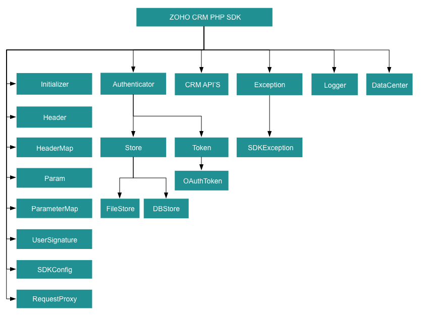

License
=======

    Copyright (c) 2021, ZOHO CORPORATION PRIVATE LIMITED 
    All rights reserved. 

    Licensed under the Apache License, Version 2.0 (the "License"); 
    you may not use this file except in compliance with the License. 
    You may obtain a copy of the License at 
    
        http://www.apache.org/licenses/LICENSE-2.0 
    
    Unless required by applicable law or agreed to in writing, software 
    distributed under the License is distributed on an "AS IS" BASIS, 
    WITHOUT WARRANTIES OR CONDITIONS OF ANY KIND, either express or implied. 
    See the License for the specific language governing permissions and 
    limitations under the License.

# ZOHO CRM PHP SDK 7.0 for API version 7

## Table Of Contents

* [Overview](#overview)
* [Registering a Zoho Client](#registering-a-zoho-client)
* [Environmental Setup](#environmental-setup)
* [Including the SDK in your project](#including-the-sdk-in-your-project)
* [Persistence](#token-persistence)
  * [DataBase Persistence](#database-persistence)
  * [File Persistence](#file-persistence)
  * [Custom Persistence](#custom-persistence)
* [Configuration](#configuration)
* [Initialization](#initializing-the-application)
* [Class Hierarchy](#class-hierarchy)
* [Responses And Exceptions](#responses-and-exceptions)
* [Multi-User support in the PHP SDK](#multi-user-app)
* [Sample Code](#sdk-sample-code)

## Overview

Zoho CRM PHP SDK offers a way to create client PHP applications that can be integrated with Zoho CRM.

## Registering a Zoho Client

Since Zoho CRM APIs are authenticated with OAuth2 standards, you should register your client app with Zoho. To register your app:

- Visit this page [https://api-console.zoho.com/](https://api-console.zoho.com)

- Click `ADD CLIENT`.

- Choose the `Client Type`.

- Enter **Client Name**, **Client Domain** or **Homepage URL** and **Authorized Redirect URIs** then click `CREATE`.

- Your Client app will be created.

- Select the created OAuth client.

- Generate grant token by providing the necessary scopes, time duration (the duration for which the generated token is valid) and Scope Description.

## Environmental Setup

PHP SDK is installable through **Composer**. **Composer** is a tool for dependency management in PHP. SDK expects the following from the client app.

- Client app must have PHP(version 7 and above) with curl extension enabled.

- PHP SDK must be installed into client app though **Composer**.

## Including the SDK in your project

You can include the SDK to your project using:

- Install **Composer** (if not installed).

  - Run this command to install the composer.

    ```sh
    curl -sS https://getcomposer.org/installer | php
    ```

  - To install composer on mac/linux machine:

    ```sh
    https://getcomposer.org/doc/00-intro.md#installation-linux-unix-osx
    ```

  - To install composer on windows machine:

    ```sh
    https://getcomposer.org/doc/00-intro.md#installation-windows
    ```

- Install **PHP SDK**.

  - Navigate to the workspace of your client app.

  - Run the command below:

    ```sh
    composer require zohocrm/php-sdk-7.0:2.0.0
    ```

  - The PHP SDK will be installed and a package named vendor will be created in the workspace of your client app.

- Using the SDK.

  - Add the below line in PHP files of your client app, where you would like to make use of PHP SDK.

    ```php
    require 'vendor/autoload.php';
    ```

  Through this line, you can access all the functionalities of the PHP SDK. The namespaces of the class to be used must be included within the "use" statement.

---
**Note** 

> - If you are facing SSL related issues, make sure your SSL certificate is valid and configured properly. You can download the certificate bundle from here. To add the SSL certificate, locate the php.ini file in the PHP folder in your system,  and add these lines to your certificate:

        - curl.cainfo="<filepath>/cacert.pem"
        - openssl.cafile="<filepath>/cacert.pem"

> - **serialize_precision**, **int** - The number of significant digits stored while serializing floating point numbers. From PHP 7.1.0, the default value for this key is -1. This means that the floating point value will not be rounded off during serializing and un-serializing the JSON. 
Prior to PHP 7.1.0, the default value was 17, meaning the floating point number will be rounded off to 17 digits(or to the number specified in this key). You can change this value in **php.ini** file according to the number of decimal places you have set for currency or decimal fields in your CRM org.
---

## Token Persistence

Token persistence refers to storing and utilizing the authentication tokens that are provided by Zoho. Token persistence enables the SDK to automatically refresh the access token after initialization using the refresh token without the need for user intervention. There are three ways provided by the SDK in which persistence can be utilized. They are DataBase Persistence, File Persistence, and Custom Persistence. Please note that the default method of token persistence provided by the Zoho CRM SDK is File persistence.

### Table of Contents

- [DataBase Persistence](#database-persistence)

- [File Persistence](#file-persistence)

- [Custom Persistence](#custom-persistence)

### Implementing OAuth Persistence

Once the application is authorized, OAuth access and refresh tokens can be used for subsequent user data requests to Zoho CRM. Hence, they need to be persisted by the client app.

The persistence is achieved by writing an implementation of the inbuilt **TokenStore interface**, which has the following callback methods.

- **findToken(Token $token)** - invoked before firing a request to fetch the saved tokens. This method should return an implementation of **Token interface** object for the library to process it.

- **saveToken(Token $token)** - invoked after fetching access and refresh tokens from Zoho.

- **deleteToken($id)** - invoked before saving the latest tokens.

- **getTokens()** - The method to retrieve all the stored tokens.

- **deleteTokens()** - The method to delete all the stored tokens.

- **findTokenById($id)** - This method is used to retrieve the user token details based on unique ID.

Note:

- $id is a string.

- $token is an instance of **Token** interface.

### DataBase Persistence

Database persistence is a technique that involves storing and retrieving data from a database. In case the user prefers to use the default DataBase persistence, **MySQL** can be used.

- Create a table in your Database with required columns

  - id varchar(10)

  - user_name varchar(255)

  - client_id varchar(255)

  - client_secret varchar(255)

  - refresh_token varchar(255)

  - access_token varchar(255)

  - grant_token varchar(255)

  - expiry_time varchar(20)

  - redirect_url varchar(255)

  - api_domain varchar(255)

Note:
- Custom database name and table name can be set in DBStore instance

#### MySQL Query

```sql
CREATE DATABASE zohoauth;
CREATE TABLE oauthtoken (
  id varchar(10) NOT NULL,
  user_name varchar(255) NOT NULL,
  client_id varchar(255),
  client_secret varchar(255),
  refresh_token varchar(255),
  access_token varchar(255),
  grant_token varchar(255),
  expiry_time varchar(20),
  redirect_url varchar(255),
  api_domain varchar(255),
  primary key (id)
);
```

#### Create DBStore object

```php
/*
* Create an instance of TokenStore.
* host -> DataBase host name. Default "jdbc:mysql://localhost"
* databaseName -> DataBase name. Default "zohooauth"
* userName -> DataBase user name. Default "root"
* tableName -> DataBase table name. Default "oauthtoken"
* password -> DataBase password. Default ""
* portNumber -> DataBase port number. Default "3306"
*/
// $tokenstore = (new DBBuilder())->build();
$tokenstore = (new DBBuilder())
->host("hostName")
->databaseName("databaseName")
->userName("userName")
->portNumber("portNumber")
->tableName("tableName")
->password("password")
->build();
```

### File Persistence

In case of default File Persistence, the user can persist tokens in the local drive, by providing the the absolute file path to the FileStore object.

- The File contains

  - id

  - user_name

  - client_id

  - client_secret

  - refresh_token

  - access_token

  - grant_token

  - expiry_time

  - redirect_url

  - api_domain

#### Create FileStore object

```php
//Parameter containing the absolute file path to store tokens
$tokenstore = new FileStore("/usr/php_sdk_token.txt");
```

### Custom Persistence

Users can create their own logic for storing and retrieving authentication tokens using the custom persistence technique. To use Custom Persistence, the user must implement **TokenStore interface** (**com\zoho\api\authenticator\store\TokenStore**) and override the methods.

```php
<?php
use com\zoho\api\authenticator\Token;
use com\zoho\api\authenticator\store\TokenStore;

class CustomStore implements TokenStore
{
    public function findToken(Token $token)
    {
      // Add code to get the token
      return null;
    }

    public function saveToken(Token $token)
    {
      // Add code to save the token
    }

    public function deleteToken($id)
    {
      // Add code to delete the token
    }

    public function getTokens()
    {
      //Add code to retrieve all the stored tokens
      return  null;
    }
    
    public function deleteTokens()
    {
      //Add code to delete all the stored tokens.
    }

    public function findTokenById($id)
    {
      // Add code to get the token using unique id
      return null;
    }
}
?>
```

## Configuration

Before you get started with creating your PHP application, you need to register your client and authenticate the app with Zoho.

| Mandatory Keys | Optional Keys  |
|:---------------|:---------------|
| environment    | logger         |
| token          | store          |
|                | SDKConfig      |
|                | requestProxy   |
|                | resourcePath   |

----

The **environment** key contains the domain information to make API calls. The **token** key represents the OAuth info, including the clientID, clientSecret, grantToken, redirectURL, refreshToken or accessToken depending on the flow that you use. Refer to **create an instance of OAuthToken** for more details.

- Configure the API environment which decides the domain and the URL to make API calls.

    ```php
    /*
    * Configure the environment
    * which is of the pattern Domain::Environment
    * Available Domains: USDataCenter, EUDataCenter, INDataCenter, CNDataCenter, AUDataCenter,CADataCenter
    * Available Environments: PRODUCTION(), DEVELOPER(), SANDBOX()
    */
    $environment = USDataCenter::PRODUCTION();
    ```

- Create an instance of **OAuthToken** with the information that you get after registering your Zoho client. In the context of Token persistence, the grant token flow and refresh token flow involve storing and persistence the token.However, the access token flow does not involve token persistence and the access token is directly utilized for API calls. Depending on the tokens available with you, choose grantToken flow, refreshToken flow or accessToken flow.
  
  - By default, the findUser key is set to true, to set userSignature. However, this requires the ***ZohoCRM.users.READ*** and ***ZohoCRM.org.READ*** scopes to be mandatory. If you do not want to set userSignature, you must set the findUser key to false.

  - Use the following method for **grantToken flow :**
  ```php
  $token = (new OAuthBuider())
  ->clientID("clientId")
  ->clientSecret("clientSecret")
  ->grantToken("grantToken")
  ->redirectURL("redirectURL")
  ->findUser(false)// by default true
  ->build();
  ```
  - Use the following method for **refreshToken flow :**
  ```php
  $token = (new OAuthBuilder())
    ->clientId("clientId")
    ->clientSecret("clientSecret")
    ->refreshToken("refreshToken")
    ->redirectURL("redirectURL")
    ->findUser(false)// by default true
    ->build();
  ```
  - Use the following method for **accessToken flow :**
  ```php
  $token = (new OAuthBuilder())
    ->accessToken("accessToken")
    ->findUser(false)// by default true
    ->build();
  ```
  - Use the following method for **Id flow :**
  ```php
  $token = (new OAuthBuilder())
    ->id("id")
    ->build();
  ```

- Create an instance of **Logger** Class to log exception and API information.

    ```php
    /*
    * Create an instance of Logger Class that requires the following
    * level -> Level of the log messages to be logged. Can be configured by typing Levels "::" and choose any level from the list displayed.
    * filePath -> Absolute file path, where messages need to be logged.
    */
    $logger = (new LogBuilder())
    ->level(Levels::INFO)
    ->filePath("/usr/php_sdk_log.log")
    ->build();
    ```

- Create an instance of **TokenStore** to persist tokens, used for authenticating all the requests. By default, the SDK creates the sdk_tokens.txt created in the current working directory) to persist the tokens.

    ```php
    /*
    * Create an instance of DBStore that requires the following
    * host -> DataBase host name. Default value "localhost"
    * databaseName -> DataBase name. Default  value "zohooauth"
    * userName -> DataBase user name. Default value "root"
    * password -> DataBase password. Default value ""
    * portNumber -> DataBase port number. Default value "3306"
    * tabletName -> DataBase table name. Default value "oauthtoken"
    */
    //$tokenstore = (new DBBuilder())->build();

    $tokenstore = (new DBBuilder())
    ->host("hostName")
    ->databaseName("dataBaseName")
    ->tableName("tableName")
    ->userName("userName")
    ->password("password")
    ->portNumber("portNumber")
    ->build();
    ```
    - Use the following method for File Store
    ```php
    $tokenStore = new FileStore("absolute_file_path");
    ```
    - Use the following method for Custom Store
    ```php
    $tokenStore = new CustomStore();
    ```

- Create an instance of SDKConfig containing SDK configurations.

    ```php
    /*
    * By default, the SDK creates the SDKConfig instance
    * autoRefreshFields (default value is false)
    * true - all the modules' fields will be auto-refreshed in the background, every hour.
    * false - the fields will not be auto-refreshed in the background. The user can manually delete the file(s) or refresh the fields using methods from ModuleFieldsHandler(com\zoho\crm\api\util\ModuleFieldsHandler)
    *
    * pickListValidation (default value is true)
    * A boolean field that validates user input for a pick list field and allows or disallows the addition of a new value to the list.
    * true - the SDK validates the input. If the value does not exist in the pick list, the SDK throws an error.
    * false - the SDK does not validate the input and makes the API request with the user’s input to the pick list
    *
    * enableSSLVerification (default value is true)
    * A boolean field to enable or disable curl certificate verification
    * true - the SDK verifies the authenticity of certificate
    * false - the SDK skips the verification
    */
    $autoRefreshFields = false;
    $pickListValidation = false;
    $enableSSLVerification = true;
    //The number of seconds to wait while trying to connect. Use 0 to wait indefinitely.
    $connectionTimeout = 2;
    //The maximum number of seconds to allow cURL functions to execute.
    $timeout = 2;
    $sdkConfig = (new SDKConfigBuilder())
    ->autoRefreshFields($autoRefreshFields)
    ->pickListValidation($pickListValidation)
    ->sslVerification($enableSSLVerification)
    ->connectionTimeout($connectionTimeout)
    ->timeout($timeout)
    ->build();
    ```

- Create an instance of RequestProxy containing the proxy properties of the user.

    ```php
     $requestProxy = (new ProxyBuilder())
     ->host("proxyHost")
     ->port("proxyPort")
     ->user("proxyUser")
     ->password("password")
     ->build();
    ```

- The path containing the absolute directory path to store user specific files containing module fields information.

    ```php
    $resourcePath = "/usr";
    ```

## Initializing the Application

Initialize the SDK using the following code.

```php
<?php
use com\zoho\api\authenticator\OAuthBuilder;
use com\zoho\api\authenticator\store\DBBuilder;
use com\zoho\crm\api\InitializeBuilder;
use com\zoho\crm\api\dc\USDataCenter;
use com\zoho\api\logger\LogBuilder;
use com\zoho\api\logger\Levels;
use com\zoho\crm\api\SDKConfigBuilder;
use com\zoho\crm\api\ProxyBuilder;

require_once 'vendor/autoload.php';

class Initialize
{
    public static function initialize()
    {
        $logger = (new LogBuilder())
            ->level(Levels::INFO)
            ->filePath("/users/php_sdk_log.log")
            ->build();

        $environment = USDataCenter::PRODUCTION();

        $token = (new OAuthBuilder())
            ->clientId("clientId")
            ->clientSecret("clientSecret")
            ->refreshToken("grantToken")
            ->redirectURL("redirectURL")
            ->build();

        $tokenstore = (new DBBuilder())
            ->host("hostName")
            ->databaseName("dataBaseName")
            ->userName("userName")
            ->password("password")
            ->portNumber("portNumber")
            ->tableName("tableName")
            ->build();

        $autoRefreshFields = false;
        $pickListValidation = false;
        $connectionTimeout = 2; //The number of seconds to wait while trying to connect. Use 0 to wait indefinitely.
        $timeout = 2; //The maximum number of seconds to allow cURL functions to execute.
        $enableSSLVerification = false;
        $sdkConfig = (new SDKConfigBuilder())
            ->autoRefreshFields($autoRefreshFields)
            ->pickListValidation($pickListValidation)
            ->sslVerification($enableSSLVerification)
            ->connectionTimeout($connectionTimeout)
            ->timeout($timeout)
            ->build();

        $resourcePath = "/users/php-application";

        $requestProxy = (new ProxyBuilder())
            ->host("proxyHost")
            ->port(0)
            ->user("proxyUser")
            ->password("password")
            ->build();

        (new InitializeBuilder())
            ->environment($environment)
            ->token($token)
            ->store($tokenstore)
            ->SDKConfig($sdkConfig)
            ->resourcePath($resourcePath)
            ->logger($logger)
            ->requestProxy($requestProxy)
            ->initialize();
    }
}
Initialize::initialize();
?>
```

- You can now access the functionalities of the SDK. Refer to the sample codes to make various API calls through the SDK.

## Class Hierarchy



## Responses and Exceptions

All SDK method calls return an instance of the **APIResponse** class.

Use the **getObject()** method in the returned **APIResponse** object to obtain the response handler interface depending on the type of request (**GET, POST,PUT,DELETE**).

**APIResponse&lt;ResponseHandler&gt;** and **APIResponse&lt;ActionHandler&gt;** are the common wrapper objects for Zoho CRM APIs’ responses.

Whenever the API returns an error response, the response will be an instance of **APIException** class.

All other exceptions such as SDK anomalies and other unexpected behaviours are thrown under the **SDKException** class.

### GET Requests

- The **getObject()** of the returned APIResponse instance returns the response as follows.

- Most of the APIs follows the **Common** Structure as below.

  - The **ResponseHandler interface** encompasses the following
    - **ResponseWrapper class** (for **application/json** responses)
    - **FileBodyWrapper class** (for File download responses)
    - **APIException class**


- Some of the APIs follow the **Particular** Structure as below.

  - The **ResponseHandler interface** encompasses the following
    - **HistoryWrapper class** (for **application/json** responses in **backup** API, holds the list of instances of **History class** and instance of **Info class**)
    - **UrlsWrapper class** (for **application/json** responses in **backup** API, holds the instance of **Urls class**)
    - **SourcesCountWrapper class** (for **application/json** responses in **UserGroups** API, holds the List of instances of **SourceCount class**)
    - **SourcesWrapper class** (for **application/json** responses in **Usergroups** APi, holds the List of instances of **Sources class** and instance of **Info class**)


  - The **ResponseWrapper interface** in **BulkWrite** API encompasses the following
    - **BulkWriteResponse class** (for **application/json** responses)
    - **APIException class**

  - The **CountHandler interface** encompasses the following
    - **CountWrapper class** (for **application/json** responses in **Record** API, holds the Long **count**)
    - **APIException class**

  - The **DeletedRecordsHandler interface** encompasses the following
    - **DeletedRecordsWrapper class** (for **application/json** responses in **Record** API, holds the list of instances of **DeletedRecord class** and instance of **Info class**)
    - **APIException class**

  - The **DownloadHandler interface** encompasses the following
    - **FileBodyWrapper class** (for File download responses)
    - **APIException class**

  - The **MassUpdateResponseHandler interface** encompasses the following
    - **MassUpdateResponseWrapper class** (for **application/json** responses in **Record** API, holds the list of instances of **MassUpdateResponse interface**)
    - **APIException class**

  - The **MassUpdateResponse interface** encompasses of following
    - **MassUpdate class** (for **application/json** responses)
    - **APIException class**

  - The **ValidationHandler interface** in **UserTerritories** API encomposses the following
    - **ValidationWrapper class** (for **application/json** responses, holds the list of instances of **ValidationGroup interface**)
    - **APIException class**

  - The **ValidationGroup interface** in **UserTerritories** API encompasses the following
    - **Validation class**
    - **BulkValidation class**

### POST, PUT, DELETE Requests

- The **getObject()** of the returned APIResponse instance returns the response as follows.

- Most of the APIs follows the **Common** Structure as.

  - The **ActionHandler interface** encompasses the following
    - **ActionWrapper class** (for **application/json** responses)
    - **APIException class**

  - The **ActionWrapper class** contains **Property/Properties** that may contain one/list of **ActionResponse interfaces**.

  - The **ActionResponse interface** encompasses the following
    - **SuccessResponse class** (for **application/json** responses)
    - **APIException class**

- Some of the APIs follow the **Particular** Structure as.

  - The **ActionHandler interface** encompasses the following
    - **ActionWrapper class** (for **application/json** responses)
    - **APIException class**

  - The **ActionWrapper class** contains **Property/Properties** that may contain one/list of **ActionResponse interface**.

  - The **RecordActionHandler interface** encompasses the following
    - **RecordActionWrapper class** (for **application/json** responses in **Tags** API, holds the list of instance of **RecordActionResponse interface**, Boolean **wfScheduler**, String **successCount** and Boolean **lockedCount**)
    - **APIException class**

  - **RecordActionResponse interface** encompasses the following
    - **RecordSuccessResponse class** (for **application/json** responses)
    - **APIException class**

  - The **ActionHandler interface** in **Currencies** API encompasses the following
    - **BaseCurrencyActionWrapper class** (for **application/json** responses)
    - **APIException class**

  - The **BaseCurrencyActionWrapper class** contains **Property/Properties** that contain **BaseCurrencyActionResponse interface**.

  - The **BaseCurrencyActionResponse interface** encompasses the following
    - **SuccessResponse class** (for **application/json** responses)
    - **APIException class**

  - The **MassUpdateActionHandler interface** encompasses the following
    - **MassUpdateActionWrapper class** (for **application/json** responses in **Record** API, holds the list of instances of **MassUpdateActionResponse interface**)
    - **APIException class**

  - The **MassUpdateActionResponse interface** encompasses of following
    - **MassUpdateSuccessResponse class** (for **application/json** responses)
    - **APIException class**

  - The **FileHandler interface** in **Record** API encompasses the following
    - **SuccessResponse class** (for **application/json** responses)
    - **APIException class**

  - The **SignActionHandler interface** in **MailMerge** API encompasses the following
    - **SignActionWrapper class** (for **application/json** responses)
    - **APIException class**
    
  - The **DeleteActionHandler interface** encompasses the following
    - **DeleteActionWrapper class** (for **application/json** responses in **ShareRecords** API, holds the instance of **DeleteActionResponse interface**)
    - **APIException class**
  - The **DeleteActionResponse interface** encompasses the following
    - **SuccessResponse class** (for **application/json** responses)
    - **APIException class**

  - The **TransferActionHandler interface** in **UserTerritories** API encompasses the following
    - **TransferActionWrapper class** (fro **application/json** responses , holds the list of instances of **TransferActionResponse interface**)

  - The **TransferActionResponse interface** encompasses the following
    - **SuccessResponse class** (for **application/json** responses)
    - **APIException class**

  - The **ActionResponse interface** in **Territories** API encompasses the following
    - **Success class** (for **application/json** responses)
    - **APIException class**

  - The **TransferPipelineActionHandler interface** in **Pipeline** API encompasses the following
    - **TransferPipelineActionWrapper class** (for **application/json** responses, holds the list of insatnces of **TransferPipelineActionResponse interface**)
    - **APIException class**

  - The **TransferPipelineActionResponse interface** in **Pipeline** API encompasses the following
    - **TransferPipelineSuccessResponse class** (for **application/json** responses)
    - **APIException class**

## Multi-user App

Multi-users functionality is achieved using **switchUser()** method

```php
  (new InitializeBuilder())
  ->environment($environment)
  ->token($token)
  ->SDKConfig($configInstance)
  ->switchUser();
```

To Remove a user's configuration in SDK. Use the below code

```php
  Initializer::removeUserConfiguration($token);
```

```php
<?php
use com\zoho\api\authenticator\OAuthBuilder;
use com\zoho\crm\api\InitializeBuilder;
use com\zoho\crm\api\record\GetRecordsParam;
use com\zoho\crm\api\dc\USDataCenter;
use com\zoho\crm\api\dc\EUDataCenter;
use com\zoho\crm\api\record\RecordOperations;
use com\zoho\crm\api\record\GetRecordsHeader;
use com\zoho\crm\api\HeaderMap;
use com\zoho\crm\api\ParameterMap;

require_once 'vendor/autoload.php';

class MultiThread
{
  public function main()
  {
    $environment1 = USDataCenter::PRODUCTION();

    $token1 = (new OAuthBuilder())
    ->clientId("clientId")
    ->clientSecret("clientSecret")
    ->grantToken("grantToken")
    ->redirectURL("redirectURL")
    ->build();

    (new InitializeBuilder())
    ->environment($environment1)
    ->token($token1)
    ->initialize();

    $this->getRecords("Leads");

    $environment2 = EUDataCenter::PRODUCTION();

    $token2 = (new OAuthBuilder())
    ->clientId("clientId2")
    ->clientSecret("clientSecret2")
    ->refreshToken("refreshToken2")
    ->redirectURL("redirectURL2")
    ->build();

    $this->getRecords("Leads");

    // Initializer::removeUserConfiguration($token);

    (new InitializeBuilder())
    ->environment($environment2)
    ->token($token2)
    ->switchUser();

    $this->getRecords("Contacts");
  }

  public function getRecords($moduleAPIName)
  {
    try
    {
      $recordOperations = new RecordOperations($moduleAPIName);
      $paramInstance = new ParameterMap();
      $fieldNames = array("id", "City");
      foreach ($fieldNames as $fieldName) 
      {
          $paramInstance->add(GetRecordsParam::fields(), $fieldName);
      }  
      $headerInstance = new HeaderMap();
      $ifmodifiedsince = date_create("2020-06-02T11:03:06+05:30")->setTimezone(new \DateTimeZone(date_default_timezone_get()));
      $headerInstance->add(GetRecordsHeader::IfModifiedSince(), $ifmodifiedsince);
      $response = $recordOperations->getRecords($paramInstance, $headerInstance);
      echo($response->getStatusCode() . "\n");
      print_r($response->getObject());
      echo("\n");
    }
    catch (\Exception $e)
    {
      print_r($e);
    }
  }
}
$obj = new MultiThread();
$obj->main();
?>
```

- The program execution starts from main().

- The details of **"user1"** are is given in the variables user1, token1, environment1.

- Similarly, the details of another user **"user2"** is given in the variables user2, token2, environment2.

- Then, the **switchUser()** function is used to switch between the **"user1"** and **"user2"** as required.

- Based on the latest switched user, the **$this->getRecords($moduleAPIName)** will fetch record.

## SDK Sample code

```php
<?php
use com\zoho\api\authenticator\OAuthBuilder;
use com\zoho\crm\api\dc\USDataCenter;
use com\zoho\crm\api\HeaderMap;
use com\zoho\crm\api\InitializeBuilder;
use com\zoho\crm\api\record\ActionWrapper;
use com\zoho\crm\api\record\APIException;
use com\zoho\crm\api\record\BodyWrapper;
use com\zoho\crm\api\record\Record;
use com\zoho\crm\api\record\RecordOperations;
use com\zoho\crm\api\record\SuccessResponse;
use com\zoho\crm\api\tags\Tag;
use com\zoho\crm\api\record\Leads;
use com\zoho\crm\api\util\Choice;

require_once "vendor/autoload.php";

class CreateRecords
{
    public static function initialize()
    {
        $environment = USDataCenter::PRODUCTION();
        $token = (new OAuthBuilder())
            ->clientId("client_id")
            ->clientSecret("client_secret")
            ->refreshToken("refresh_token")
            ->build();
        (new InitializeBuilder())
            ->environment($environment)
            ->token($token)
            ->initialize();
    }
    public static function createRecords(String $moduleAPIName)
    {
        $recordOperations = new RecordOperations($moduleAPIName);
        $bodyWrapper = new BodyWrapper();
        $records = array();
        $record1 = new Record();
        $record1->addFieldValue(Leads::City(), "City");
        $record1->addFieldValue(Leads::Company(), "company");
        $record1->addFieldValue(Leads::LastName(), "FROm PHP");
        $record1->addFieldValue(Leads::FirstName(), "First Name");
        $record1->addFieldValue(Leads::Email(), "abc@zoho.com");
        $tagList = array();
        $tag = new Tag();
        $tag->setName("TestTask");
        array_push($tagList, $tag);
        $record1->setTag($tagList);
        array_push($records, $record1);
        $bodyWrapper->setData($records);
        $headerInstance = new HeaderMap();
        $response = $recordOperations->createRecords($bodyWrapper, $headerInstance);
        if ($response != null) {
            echo ("Status Code: " . $response->getStatusCode() . "\n");
            if ($response->isExpected()) {
                $actionHandler = $response->getObject();
                if ($actionHandler instanceof ActionWrapper) {
                    $actionWrapper = $actionHandler;
                    $actionResponses = $actionWrapper->getData();
                    foreach ($actionResponses as $actionResponse) {
                        if ($actionResponse instanceof SuccessResponse) {
                            $successResponse = $actionResponse;
                            echo ("Status: " . $successResponse->getStatus()->getValue() . "\n");
                            echo ("Code: " . $successResponse->getCode()->getValue() . "\n");
                            echo ("Details: ");
                            foreach ($successResponse->getDetails() as $key => $value) {
                                echo ($key . " : ");
                                print_r($value);
                                echo ("\n");
                            }
                            echo ("Message: " . ($successResponse->getMessage() instanceof Choice ? $successResponse->getMessage()->getValue() : $successResponse->getMessage()) . "\n");
                        }
                        else if ($actionResponse instanceof APIException) {
                            $exception = $actionResponse;
                            echo ("Status: " . $exception->getStatus()->getValue() . "\n");
                            echo ("Code: " . $exception->getCode()->getValue() . "\n");
                            echo ("Details: ");
                            foreach ($exception->getDetails() as $key => $value) {
                                echo ($key . " : "); print_r($value); echo("\n");
                            }
                            echo ("Message : " . ($exception->getMessage() instanceof Choice ? $exception->getMessage()->getValue() : $exception->getMessage()) . "\n");
                        }
                    }
                }
                else if ($actionHandler instanceof APIException) {
                    $exception = $actionHandler;
                    echo ("Status: " . $exception->getStatus()->getValue() . "\n");
                    echo ("Code: " . $exception->getCode()->getValue() . "\n");
                    echo ("Details: ");
                    foreach ($exception->getDetails() as $key => $value) {
                        echo ($key . " : " . $value . "\n");
                    }
                    echo ("Message : " . ($exception->getMessage() instanceof Choice ? $exception->getMessage()->getValue() : $exception->getMessage()) . "\n");
                }
            } else {
                print_r($response);
            }
        }
    }
}
$moduleAPIName = "leads";
CreateRecords::initialize();
CreateRecords::createRecords($moduleAPIName);
?>
```
